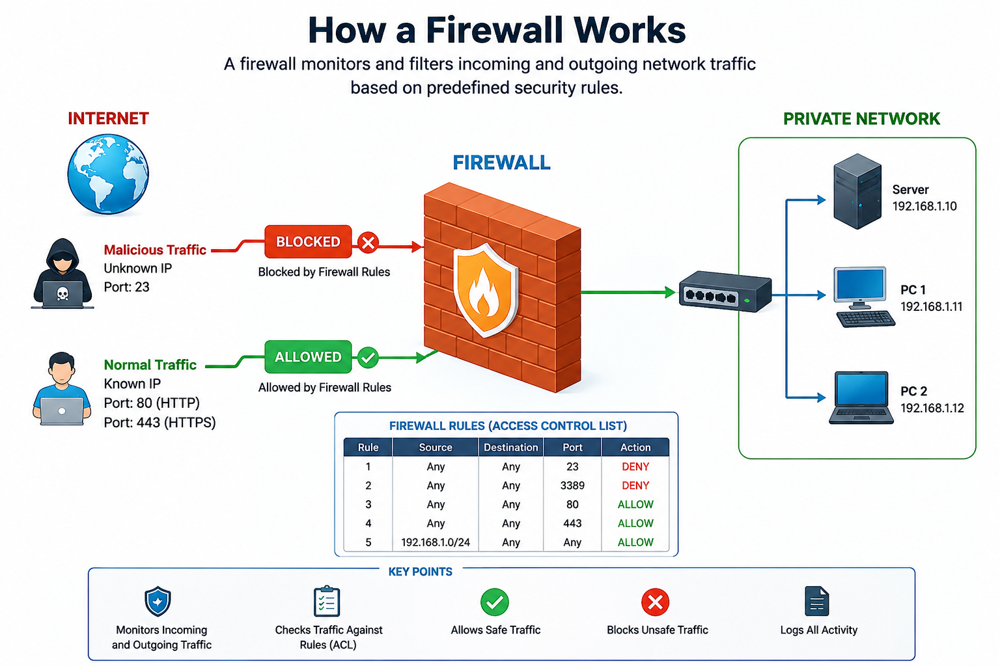

### Firewall

### What is a Firewall?

A **firewall** is a security system (hardware or software) that monitors and filters incoming and outgoing network traffic based on predefined security rules. It blocks unauthorized access while allowing trusted traffic to pass.

> **In Simple Words:**  
> A firewall is a security system that protects a private network from unauthorized access. It allows safe traffic and blocks harmful or unwanted traffic.

### Why is a Firewall Used?

A firewall is used to:

- Protect computers and networks from hackers.
- Block unauthorized access.
- Stop malicious or unwanted traffic.
- Control which traffic can enter or leave the network.
- Improve overall network security.

### Purpose of a Firewall

The main purpose of a firewall is to create a **security barrier** between a **private network** and the **public Internet**.

```text
          Internet
              │
      ┌────────────────┐
      │    Firewall    │
      └────────────────┘
              │
      Private Network
    (PCs, Servers, LAN)
```

### How Does a Firewall Work?

A firewall inspects every incoming and outgoing data packet.

It compares each packet with predefined **Firewall Rules (Access Control List - ACL)** and decides whether to allow or block the traffic.

- ✅ Allow → Safe Traffic
- ❌ Deny / Block → Unsafe Traffic

### Example

| Port | Service | Action |
|------|---------|--------|
| 80 | HTTP | ✅ Allow |
| 443 | HTTPS | ✅ Allow |
| 23 | Telnet | ❌ Block |

### Firewall Working Diagram




### Firewall Rules Can Be Based On

A firewall can filter traffic using:

- IP Address
- Domain Name
- Port Number
- Protocol
- Program/Application
- Keywords

### Types of Firewall

### 1. Host-Based Firewall (Software Firewall)

A Host-Based Firewall is installed on an individual computer and protects only that computer.

#### Features

- Installed on a single computer.
- Protects only one device.
- Software-based firewall.

#### Examples

- Windows Defender Firewall
- ZoneAlarm

### 2. Network-Based Firewall

A Network-Based Firewall protects an entire network instead of just one computer.

#### Features

- Combination of hardware and software.
- Installed between the Internet and the private network.
- Protects all connected devices.
- Commonly used by companies and organizations.

#### Network Firewall Diagram

```text
             Internet
                 │
        ┌────────────────┐
        │ Network Firewall │
        └────────────────┘
                 │
      ┌──────────┼──────────┐
      │          │          │
     PC1        PC2      Server
```

### Real-Life Example

Think of a firewall as the **security guard** at the entrance of a company.

- Employees with a valid ID → ✅ Allowed
- Unknown people → ❌ Not Allowed

Similarly,

- Safe Internet Traffic → ✅ Allowed
- Malicious Traffic → ❌ Blocked

### References

- https://www.youtube.com/watch?v=kDEX1HXybrU
- https://www.youtube.com/watch?v=eO6QKDL3p1I&list=PLBbU9-SUUCwV7Dpk7GI8QDLu3w54TNAA6&index=1
- https://www.fortinet.com/resources/cyberglossary/firewall
- https://learn.microsoft.com/windows/security/operating-system-security/network-security/windows-firewall/
- https://www.geeksforgeeks.org/computer-networks/types-of-network-firewall/
- https://chatgpt.com/